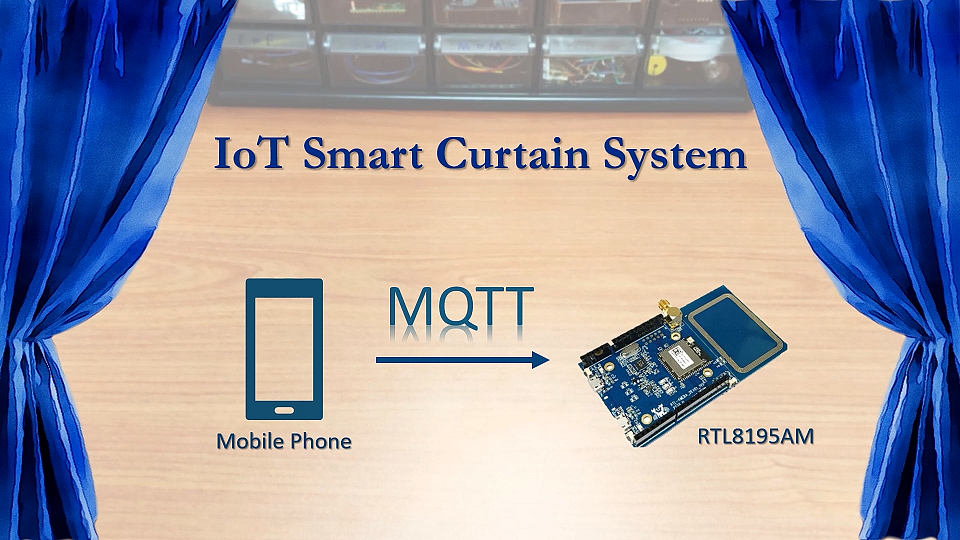

# Smart Curtain System

This project is the second one in the new IOT project series on Ameba RTL8195AM Dev. Board.

The focus of this project is to demonstrates how easy it is for Ameba Wi-Fi Dev. board to communicate with our smart phone via MQTT protocol. 

Phone to microcontroller communication used to be very difficult as they use totally different hardware interface and phone get its data mainly through the network. Now with a Wi-Fi enabled microcontroller like Ameba RTL8195AM, communication with our phone becomes a bliss. 

Of course, in this project, only a mini hand-crafted window is used for demonstration purpose but controlling a real window should not be a problem if you simply replace the servo motor with a bigger DC step motor and change the source code accordingly. 

With this smart curtain system, you may,
1.	Remotely control your curtain to open or close instantaneously
2.	Check your curtain status according to the MQTT message received 
3.	Link with the previous weather station project and automate your room from there

# Hardware
**List of hardware needed,**

Ameba 1 RTL8195AM        x1

Servo motor		 x1

Jumper wires         	 x3

DIY materials            x3

Hardware connection can be found in this Github folder, for the window, you may use a Lego house as substitute or simply build one using plywood or hard form board, the exact structure can also be found in this folder.

# Software

1. Check and make sure you have installed the ameba 1 board to Arduino IDE via adding this link into “additional boards manager URLs” under “Preference”, and install it in “board manager” under “Tools”,
https://github.com/ambiot/amb1_arduino/raw/master/Arduino_package/package_realtek.com_ameba1_index.json

2. Upload source code to your Ameba1 RTL8195 board using arduino IDE
3. Install a MQTT client App on your smart device (android/iOS)

            a)	To use a MQTT service, you must first get a free MQTT server address
    
            b)	Go to www.amebaiot.com and register for a user
    
            c)	Then go to cloud service tab and register your device
    
            d)	Once approved, the same username and password used for registration can be used to make use of the MQTT service for free
    
4. Connect to your MQTT server by keying in the correct server address, port number, username and password,

            •	For Host name: 		cloud.amebaiot.com
    
            •	For Port number: 	1883
    
            •	For username:		same as your amebaiot.com username
    
            •	For password: 		same as your amebaiot.com password
    
    
5. Key in the topics that you specified in the code, always remember to swap the publish topic and subscribe topic when you want to monitor your microcontroller’s published data.
