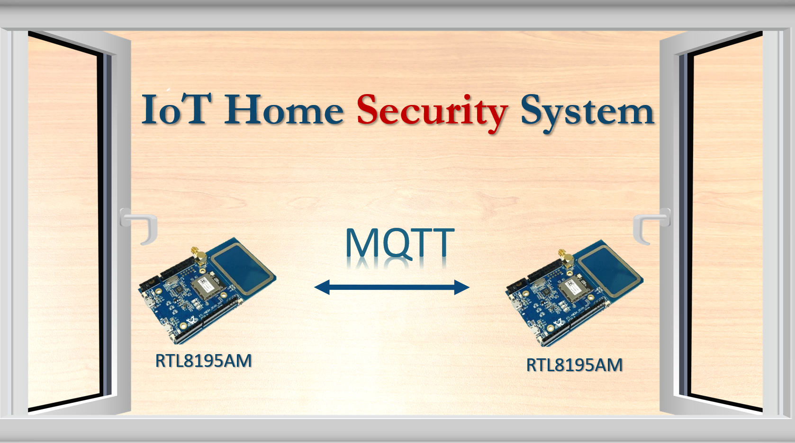
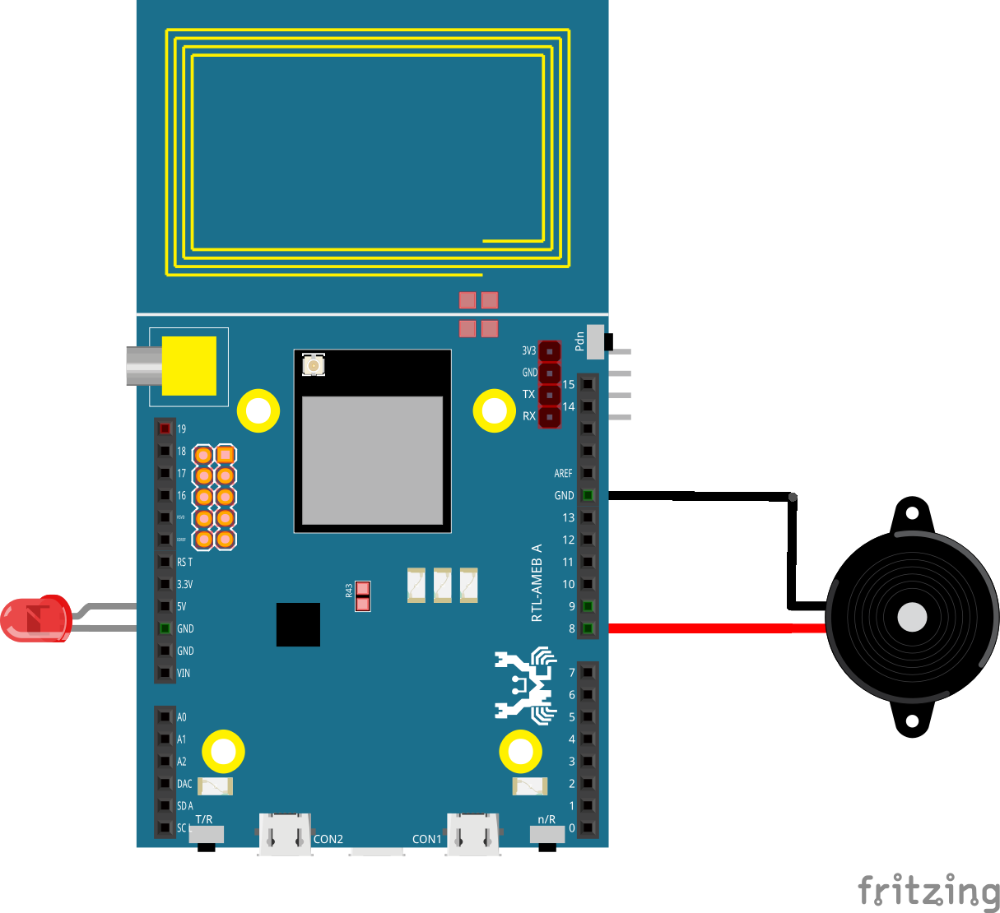
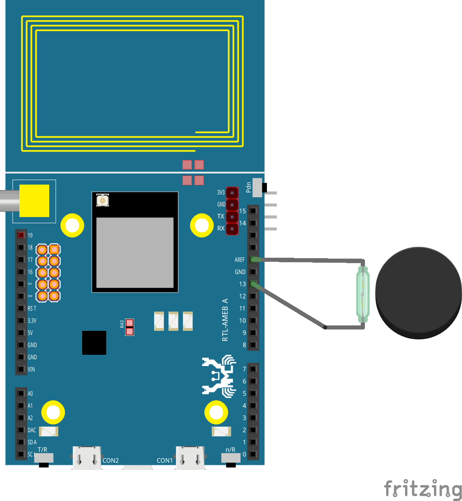

# IOT Home Security System

One of the most useful IoT applications is home security. Imagine a thief cutting your security camera wire while trying to break into your house. This won’t happen if your security system goes wireless and smart.

This project demonstrates the capability of Realtek Ameba dev. board to conduct board-to-board communication via MQTT (FREE MQTT broker hosted at cloud.amebaiot.com).

With this home security system, you will definitely be alarmed when your window/door is opened by the self-invited as the buzzer will make loud irritating noise while red LED flashes continuously.

Of course, this project has left rooms to add your own logic to it. For example, sending MQTT messages to your phone to alert you, or to an IP camera to capture the image of the thief.

# Hardware Preparation
- Ameba1 RTL8195AM  x2
- Buzzer            x1
- LED (red)         x1
- Reed switch       x1
- Magnet            x1
- Jumpers           x6

As 2 boards are needed to implement this project, there are 2 connection illustration as follows,

# Software Preparation
1. Check and make sure you have installed the ameba 1 board to Arduino IDE via adding this link into “additional boards manager URLs” under “Preference”, and install it in “board manager” under “Tools”,
https://github.com/ambiot/amb1_arduino/raw/master/Arduino_package/package_realtek.com_ameba1_index.json

2. Copy the [buzzer source code](https://github.com/Realtek-AmebaApp/Ameba_Examples/blob/master/RTL8195AM/006_HOME_SECURITY/windowSecuritySystem_buzzer_Github.ino) and [switch source code](https://github.com/Realtek-AmebaApp/Ameba_Examples/blob/master/RTL8195AM/006_HOME_SECURITY/windowSecuritySystem_switch_Github.ino) you find in this repository to your Ameba1 RTL8195 boards respectively using arduino IDE

3. In order to connect to WiFi and MQTT server, you need to key in your WiFi SSID, WiFi passowrd, MQTT username and MQTT password,
   - username:		same as your amebaiot.com username
   - password:   	same as your amebaiot.com password
