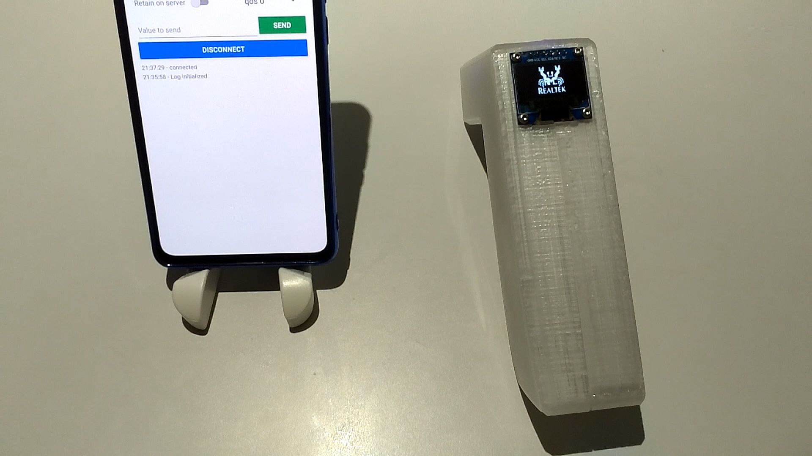
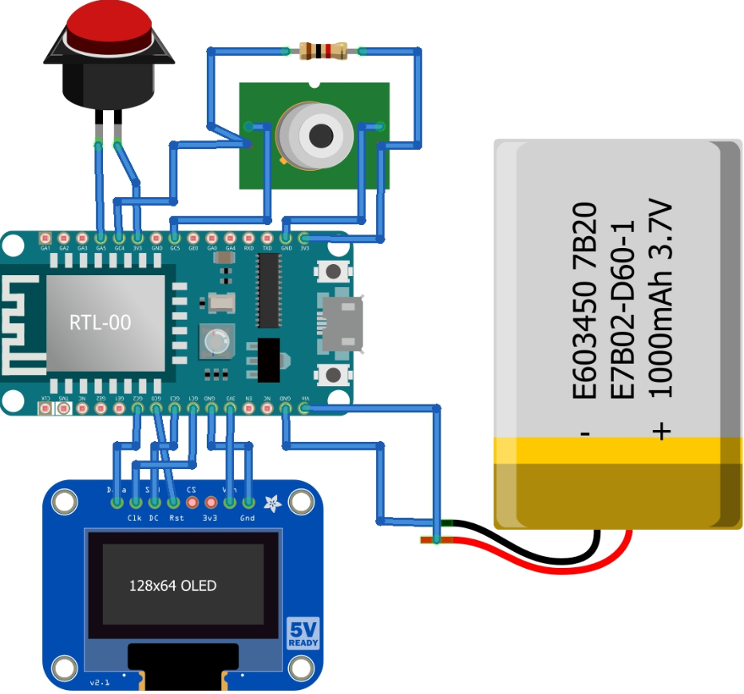

# ThermoGun🌡🔫

With COVID-19 still wreaking havoc globally, causing thousands of deaths, millions hospitalized, any useful medical device is on high demand, especially household medical device like IR non-contact thermometer 🌡🔫. Handheld thermometer usually is on high price point and is hard to come by these days, but the components needed to make thermometer are not that expensive, that give us the perfect reason to DIY one during this lockdown period.

This ThermoGun project use Ameba Dev. board RTL8710AF from Realtek, which connects to an OLED display to show temperature data obtained from the MLX90615 IR sensor. Pushing the push button not only perform data acquisition and visualization, but also publish the data via MQTT to all subscribers. 

Note: The MQTT service used in this project is a FREE MQTT broker hosted at cloud.amebaiot.com, which need to register at www.amebaiot.com . Details of registration is at the link below,
https://www.amebaiot.com/en/cloud-getting-started/

# Hardware Preparation
- Ameba1 RTL8710	x1
- 128x64 monochrome OLED display (SPI version)	x1
- MLX90615 IR temperature sensor	x1
- Push button	x1
- Jumpers 
- 3.7V LiPo battery	x1    
- 1K Ohm pull-up resistor	x1   
- 3D printed case (optional)	x1

The circuit connection are as follows,

# Software Preparation
1. Check and make sure you have installed the ameba 1 board to Arduino IDE via adding this link into “additional boards manager URLs” under “Preference”, and install it in “board manager” under “Tools”,
https://github.com/ambiot/amb1_arduino/raw/master/Arduino_package/package_realtek.com_ameba1_index.json

2. Download the [ThermoGun source code](https://github.com/Realtek-AmebaApp/Ameba_Examples/blob/master/RTL8195AM/007_THERMOGUN/Ameba_ThermoGun_RTL8710_IOT.ino) you find in this repository to your Ameba1 RTL8710 boards using arduino IDE.

3. In order to connect to WiFi and MQTT server, you need to key in your WiFi SSID, WiFi password, MQTT username and MQTT password,
   - MQTT username:		same as your amebaiot.com username
   - MQTT password:   same as your amebaiot.com password

